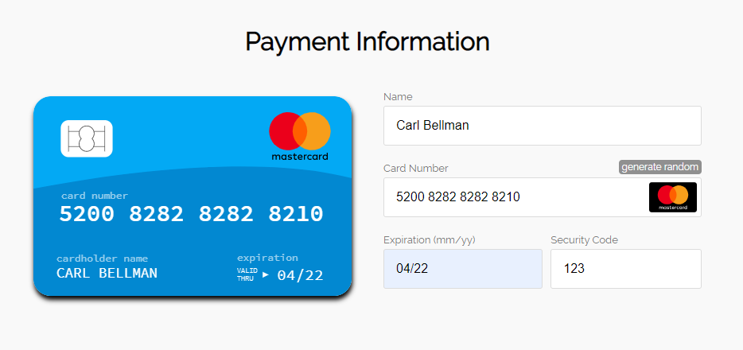

# Payment Form in Credit Card shape

Payment form using vanilla JS and the [imask.js](https://imask.js.org) library. This is a simple payment form that uses regex patterns to detect the credit card type as the user is inputting values and properly applies the relevant format associated with the card type.

## Folders in project

### Dist
This folder has the finished product.

### Src
This folder contains the sorce files used in the project.

## Reactjs

This form can easily be implemented as a Reactjs component to be used as a real integrated payment option in the checkout process.

(c) MIT 2020 | Christer Johansson
